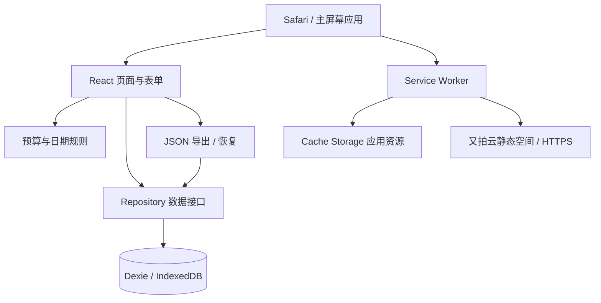

# 旅记 · 技术方案

版本：v1.0 草案｜日期：2026-09-14

关联：[产品需求文档](产品需求文档.md) · [高保真效果图](../design/trip-high-fidelity.png)。本文件定义实现方案，不代表代码、云资源或域名部署已完成。

## 1. 架构与技术选择

确定路线：React + TypeScript + Vite → Dexie + IndexedDB → PWA → npm run build → dist/ → 又拍云静态空间 → https://sks.springlearn.cn/trip/。

浏览器承担 UI、预算计算和数据持久化；又拍云仅分发静态文件。首版没有业务服务器、登录接口和数据库云端副本。用户账本不上传到静态空间。



建议依赖：React、TypeScript、Vite、Dexie、dexie-react-hooks、React Router、vite-plugin-pwa、antd-mobile；测试采用 Vitest 与 Playwright。实施时锁定相互兼容的稳定版本并提交 package-lock.json，不在文档中虚构已安装版本。UI 采用 Ant Design Mobile（antd-mobile）作为移动端基础组件库，通过 CSS 变量和局部样式实现效果图中的苹果风格。优先复用成熟交互，仅组合业务组件，不重复实现通用组件。

路由选择 HashRouter：`/#/`、`/#/trips/new`、`/#/trips/:id`、`/#/trips/:id/edit`、`/#/backup`。避免静态空间必须支持任意路径回退；PWA start_url 使用 `/trip/`，部署到 ai-skills 空间 `/trip/` 子目录，Vite base 使用 `/trip/`。

## 2. 模块边界与目录

```text
src/
  app/                 路由、应用壳、错误边界
  features/trips/      列表、创建、编辑、详情
  features/expenses/   记账弹层、编辑、流水、分类筛选
  features/backup/     导入预览、导出、恢复
  domain/              类型、金额解析、日期计算、预算纯函数
  data/                Dexie schema、迁移、repository、导入校验
  components/          组件库薄封装与金额、旅行卡片等业务组合
  pwa/                 安装引导、离线就绪、更新提示
  styles/              设计变量、布局、安全区域
public/
  icons/               PWA 和 Apple touch 图标
  covers/              内置旅行封面
```

页面不直接拼装数据库写入。repository 负责校验、事务和错误映射，domain 只接受数据与显式 today 参数，不读取隐含系统时间。组件本地状态维护未提交表单，Dexie 为已保存业务数据唯一来源；useLiveQuery 订阅读取结果，不另建重复的全局账本 store。

## 3. 数据模型

金额字段以分存储，使用安全整数。ID 使用 crypto.randomUUID；时间戳用 ISO UTC 字符串；业务日期与时间单独保存，保持当时记账的本地日历语义。

```ts
type Category = 'food' | 'stay' | 'transport' | 'fun';
interface Trip {
  id: string;
  destination: string;
  startDate: string; // YYYY-MM-DD
  endDate: string;
  people: number;
  budgetCents: number;
  currency: 'CNY';
  coverKey: string;
  createdAt: string;
  updatedAt: string;
}
interface Expense {
  id: string;
  tripId: string;
  amountCents: number;
  category: Category;
  note: string;
  spentDate: string; // 消费日期，不随设备时区变化重写
  spentTime: string; // HH:mm
  createdAt: string;
  updatedAt: string;
}
interface Setting {
  key: string;
  value: string; // 经对应设置的 schema 校验
}
```

Dexie v1 索引设计：

```ts
db.version(1).stores({
  trips: 'id, startDate, endDate, updatedAt',
  expenses: 'id, tripId, [tripId+spentDate], [tripId+category]',
  settings: 'key',
});
```

不持久化余额、状态、日合计、分类比例和预测结果，全部从旅行及支出推导，避免编辑后汇总漂移。旅行删除与关联支出删除放在同一个 readwrite 事务；新增支出在事务内检查所属旅行仍存在。首版采用硬删除，UI 必须先确认。

数据接口包括 listTrips、getTripWithExpenses、createTrip、updateTrip、deleteTrip、saveExpense、deleteExpense、exportBackup、restoreBackup。写操作完成前不显示成功。事务内只进行数据库操作，不混入网络调用或等待用户操作；符合 [Dexie 事务说明](https://dexie.org/docs/Dexie/Dexie.transaction%28%29)。

同一次提交在表单生命周期内固定 ID，提交中锁定按钮，失败后重试复用 ID；编辑同样按 ID 更新。多窗口修改采用最后一次成功提交为准，通过实时查询刷新；首版不提供协作冲突合并。

## 4. 业务计算实现

金额输入使用字符串拆分整数与小数后生成分，不用 parseFloat(value)×100 直接落库；校验完整格式、两位小数上限及 Number.isSafeInteger。单笔及预算上限为 999,999,999 分，合计每次累加检测安全整数溢出，超界应报错。

日期将校验后的年月日转换为 UTC 日序号，仅用于日历日差，避免夏令时造成天数偏差。今天取设备本地年月日；开屏、visibilitychange 回前台与本地午夜触发重算。消费日期保存后不因旅行或手机时区变动重新归组。

预算公式以产品文档第 5 节为唯一口径，实现为纯函数 computeTripSummary(trip, expenses, today)。输出总支出、余额、今日支出、分类、进度、建议值及预测不可用原因；UI 不重复计算。

今日建议使用整数分向下取整；预测用有理运算后最终取整。进度宽度裁剪不改变显示值。无支出时分类占比为零；导入或旧数据中出现零预算视为无效数据，不执行除法。查询到缺失旅行的路由显示“旅行不存在”与返回入口。

## 5. 表单、交互与适配

用共享校验函数覆盖页面输入和导入数据。日期控件优先使用组件库 DatePicker；不把效果图未出现年份理解为不可选年份。

金额键盘复用 NumberKeyboard，业务封装接受字符串值并处理金额校验；金额展示区使用可访问标签，不唤起系统键盘。备注是普通文本输入，聚焦时隐藏自定义键盘。弹层限制高度并允许内部滚动，按需监听 visualViewport 调整可用空间，不能假定所有 iPhone 键盘高度相同。

设置 viewport width=device-width, initial-scale=1, viewport-fit=cover；使用 min-height:100dvh 并提供回退；底部 padding 包含 env(safe-area-inset-bottom)。系统字体优先，输入文字至少 16px，保留用户缩放能力。

弹层具有 dialog 语义、焦点约束、关闭后焦点恢复；页面滚动锁定与解除成对处理。交互动画约 180–240ms，并尊重 prefers-reduced-motion。分类用文字加图标；剩余/超支状态不单靠颜色。

### 5.1 组件复用与苹果风格

用户已明确允许 React UI 组件库，要求苹果风格并避免重复造轮子。方案选用 Ant Design Mobile，使用其移动端交互能力，视觉仍以高保真效果图为准，不直接照搬默认页面样式。

| 场景 | 复用组件 | 业务层职责 |
| --- | --- | --- |
| 记账底部弹层 | Popup | 金额、分类、备注排布与未保存提示 |
| 金额键盘 | NumberKeyboard | 小数规则、范围校验、提交防重 |
| 日期选择 | DatePicker | 起止日期约束与日历字符串转换 |
| 人数 | Stepper | 1–99 范围与样式 |
| 表单 | Form、Input、TextArea、Button | 字段校验和保存状态 |
| 删除与菜单 | Dialog、ActionSheet | 业务文案与事务调用 |
| 提示和空态 | Toast、Empty、Skeleton | 状态映射与重试入口 |
| 预算进度与安全区域 | ProgressBar、SafeArea | 百分比裁剪和页面留白 |

通过官方主题机制及组件公开的样式接口，统一系统字体、蓝色主色、浅灰输入背景、圆角、细分隔线和按钮高度；避免依赖内部 DOM 层级的大范围覆盖。旅行卡片、预算大数字和分类汇总仍由业务布局组合。

组件库负责基础弹层行为，实际开发需验证焦点、滚动锁定、屏幕阅读器及 iOS 键盘，不因使用库就省略验收。NumberKeyboard 与 Popup 的层级及底部安全区只保留一套，防止双重遮罩或留白。按需使用组件并测量构建产物，不为相同能力叠加第二套组件库。

参考：[主题定制](https://mobile.ant.design/guide/theming/)、[Popup](https://mobile.ant.design/components/popup/)、[NumberKeyboard](https://mobile.ant.design/components/number-keyboard/)。具体 API 在实施时按锁定版本核实。

## 6. PWA 与离线资源

使用 vite-plugin-pwa 的 generateSW 策略，registerType 选择 prompt。构建生成 manifest 和/trip/ 路径 Service Worker，缓存应用 HTML、哈希 JS/CSS、图标及内置封面。所有核心资源同源，避免在线字体、远程图片导致离线页面不完整。

manifest 建议：name/short_name 为“旅记”，id 为 `/trip/`，start_url `/trip/`，scope `/trip/`，display `standalone`，background_color `#ffffff`，theme_color `#ffffff`；提供 192/512 PNG、独立 maskable 图标以及 180px apple-touch-icon。不以锁定方向代替响应式适配。

Cache Storage 保存静态资源，IndexedDB 保存账本，两者生命周期分开。仅在成功安装并确认缓存准备就绪后展示离线可用提示；首次未完成加载即断网时提供联网重试说明。离线写操作直接落本地数据库，无同步队列。

有新版时提示“新版本已就绪”，用户完成/取消未保存表单后才能刷新。更新不得强制中断记账。该模式参照 [Vite PWA 更新提示](https://vite-pwa-org.netlify.app/guide/prompt-for-update)。旧缓存由受控更新清理，但不触碰 IndexedDB；保留前一发行资源直到版本替换完成。

安装入口提供 Safari 操作说明，不能依赖 iOS 自动弹出安装提示。独立运行检测使用 display-mode:standalone，并兼容 navigator.standalone。图标与启动效果必须实机验证。

**存储隔离：**WebKit 明确指出添加到主屏幕时不会复制其他类型的本地存储，之后网站数据也不共享。因此不能把 Safari 中的 IndexedDB 自动迁移到新安装的主屏幕应用当作功能保证；采用安装优先引导和导出/恢复路径。[WebKit Safari 17.2](https://webkit.org/blog/14787/webkit-features-in-safari-17-2/)

可检测 navigator.storage.persist / persisted / estimate，支持时尝试申请持久存储并读取结果，失败不阻塞记账；不能宣称获得永久保存保证。系统清理和用户删除仍需备份应对。[WebKit 存储策略](https://webkit.org/blog/14403/updates-to-storage-policy/)

## 7. 备份、迁移与异常

备份格式为 `{ format: 'trip-backup', version: 1, exportedAt, trips, expenses }`。不导出机器相关安装提示设置，不包含任何密钥。通过 Blob 下载 JSON；iPhone 必须验证导出到“文件”和文件选择恢复的闭环，系统分享作为能力检测后的增强。

恢复流程：读取文件（首版上限 10MB）→ JSON 解析 → 校验格式版本、字段长度、金额、日期、分类、唯一 ID、外键引用、最大安全合计 → 展示数量 → 用户确认替换 → 同一事务清空并 bulkAdd → 重新查询。文件中的文字按普通文本渲染，禁止注入 HTML。任何阶段失败保留原账本。

数据库版本从 1 单调递增，迁移先在旧版本 fixture 上测试；不通过删库“修复”迁移失败。迁移错误展示原始数据未主动删除的说明和重试入口；能打开旧库时提供导出。多标签阻塞升级时提示关闭旧窗口。备份格式版本与数据库版本分别管理。

异常分为校验失败、空间不足、数据库不可用、迁移失败和应用资源失败。空间不足保留未提交输入并引导备份；数据库不可用时禁止假保存。日志只记录错误类型和应用版本，不记录备注、金额或完整账本。首版不接入第三方统计脚本。

## 8. 构建与又拍云发布

Vite 的生产构建默认产物为 dist，vite preview 仅用于本地检查。[Vite 静态部署说明](https://vite.dev/guide/static-deploy.html)

建议脚本约定：dev 启动开发环境；typecheck 执行 TypeScript 检查；test 执行单元测试；build 执行类型检查与 vite build；preview 本地验证生产构建。正式部署只上传 dist 内的内容到空间 /trip/ 目录，不上传源代码、node_modules 或本地备份。

部署前待核实的环境信息：又拍云服务名、源站类型、域名绑定、DNS、HTTPS 证书、MIME 与缓存规则设置方式。此文不假定这些资源已配置完成。凭据保留在部署环境，不放进代码或 VITE_ 前缀变量（此类变量会进入前端产物）。

| 资源 | 建议 HTTP/CDN 策略 |
| --- | --- |
| /index.html、/ | no-cache；CDN 不长期缓存，发布后刷新 |
| /sw.js 与生成的非哈希 SW 脚本 | no-cache；正确 JS MIME，不重定向到 HTML |
| manifest.webmanifest | no-cache 或短缓存，正确 manifest MIME |
| assets/ 下内容哈希文件 | public,max-age=31536000,immutable |
| 固定文件名图标 / 封面 | 短缓存，变更时改名或刷新 CDN |

实际响应头必须通过正式域名验证，不能只检查本地配置。Hash 路由不需要服务端 SPA 重写；缺失的 JS 应返回真实 404，不返回 index.html。

发布顺序：本地类型检查及测试 → build → preview 检查 → 备份上一版本产物与清单 → 上传新哈希资源、图标和依赖 → 上传入口、manifest 及 SW（SW 最后）→ 刷新必要的 CDN 缓存 → 正式域名在线与离线冒烟测试。空间支持原子目录切换时优先采用；否则上传期间保留旧哈希资源，减小混合版本风险。

回滚恢复已验证的上一套完整静态产物并刷新入口/SW 缓存；用户端仍需经历 SW 更新过程，不承诺瞬时全量回退。数据库升级采用兼容性添加策略，旧代码必须能处理新库；若数据库不向后兼容则禁止简单回滚，发布修复版本。上线前为每次数据库变更单独评估此条件。

## 9. 验证计划

| 层次 | 关键用例 |
| --- | --- |
| 单元测试 | 金额解析、0.1+0.2、超支、分类零分母、当日建议、预测门槛、跨年/闰日/单日旅行 |
| 数据层 | CRUD、旅行级联删除、事务回滚、重复提交、坏备份拒绝、恢复失败保留原库、旧 schema 迁移 |
| 浏览器流程 | 创建→记账→编辑→删除→刷新；备份恢复；错误路由；离线 CRUD；更新不丢输入 |
| iPhone 实机 | Safari 与主屏幕两个环境；安装路径、数据隔离迁移、系统键盘、安全区域、后台恢复、飞行模式、版本升级 |
| 发布验证 | HTTPS、manifest、图标、SW scope/MIME、CDN 缓存头、旧资源可用、正式域名离线重启 |

建议支持基线为 iOS 17.2+，并在实施时选择基线可用设备和当时最新正式版 iOS 验证；这是建议兼容范围，非现有测试结论。桌面自动化 WebKit 不能替代真实 iPhone PWA 测试。

性能验收目标：生产构建首屏 JS gzip 尽量≤200KB；预缓存总资源尽量≤5MB；100 个旅行、10,000 条支出的测试集上，主页面查询与汇总目标≤300ms（指定实机测量）。流水分页加载，每页 50 条；详情汇总先采用单旅行扫描，测量不达标再优化，避免提前引入冗余汇总表。

## 10. 实施里程碑与完成标准

1. 基础工程：React/TS/Vite、路由、设计变量、数据模型和金额日期函数。
2. 核心产品：四个高保真界面、旅行与支出 CRUD、统一汇总、异常状态。
3. 数据可靠性：备份恢复、事务、迁移 fixture 与自动化测试。
4. PWA：图标、离线缓存、更新提示、Safari 安装与实机验证。
5. 发布：生成 dist、配置又拍云与 HTTPS、发布回滚清单、正式域名验收。

完成标准是用户能从 Safari 安装后独立运行、离线持续记账、可靠备份恢复，并在更新后保留账本；页面能打开或构建成功本身不代表交付完成。

当前发布详情与实际缓存响应见[开发与部署](开发与部署.md)。
